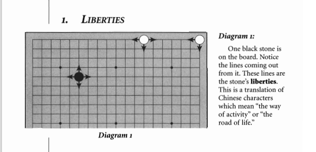

# 2. Capturing

1. [Liberties](2.-capturing.md#liberties)
2. [Capture](2.-capturing.md#capture)
3. [Atari](2.-capturing.md#atari)
4. [Capturing more than one stone](2.-capturing.md#capturing-more-than-one-stone)

### Liberties

### Capture

### Atari

### Capturing more than one stone

